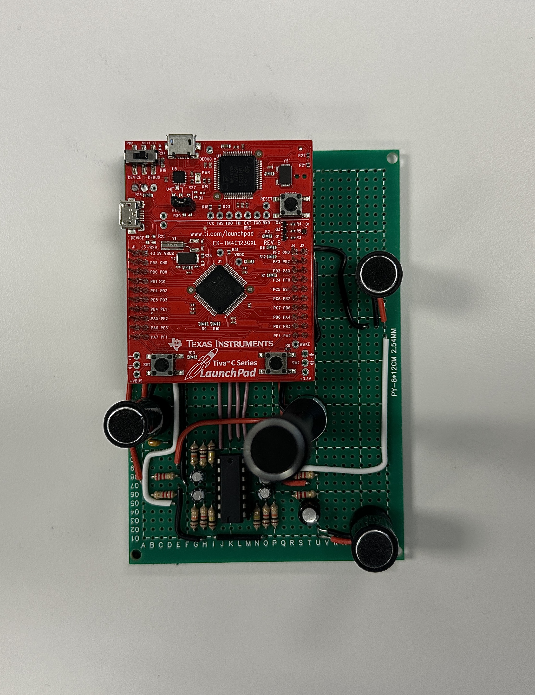

# Embedded Systems II: AoA of Multidirectional Audio System

## Overview
This project aims to develop a low-cost, low-power device capable of solving the angle of arrival (AoA) problem using a multidirectional array of microphones. The system is designed to work efficiently in resource-constrained environments, utilizing the TM4C123GH6PM microcontroller.

## Objectives
- Develop an embedded system for accurate AoA calculation.
- Ensure low power consumption and efficient operation.
- Provide a robust user interface for real-time monitoring and configuration.

## Hardware Architecture
- **Microphones and Conditioning Circuits**: Four precision microphones with amplified outputs.
- **Microcontroller**: TM4C123GH6PM ARM Cortex-M4F for handling digital signal processing.
- **Serial Interface**: UART0 for communication with a host device.

## Software Development
- Implement cross-correlation algorithms for TDoA calculation.
- Provide a command-line interface over UART for system control.

## Setup Instructions
1. Connect the hardware as per the provided circuit schematics.
2. Upload the firmware to the TM4C123GH6PM microcontroller.
3. Use a serial terminal (e.g., PuTTY) to interact with the system.

## Usage
- **Commands**:
  - `reset`: Resets the hardware.
  - `average`: Displays average microphone values.
  - `level`: Updates the detection threshold.
  - `aoa`: Returns the current angle of arrival.

## Future Improvements
- Enhance DMA buffer management.
- Upgrade to advanced ADCs for better accuracy.
- Implement adaptive threshold algorithms.

## Contributions
Contributions are welcome. Please open an issue or submit a pull request.

## License
This project is licensed under the MIT License.

