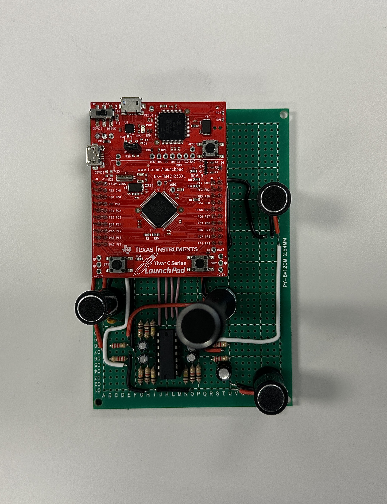
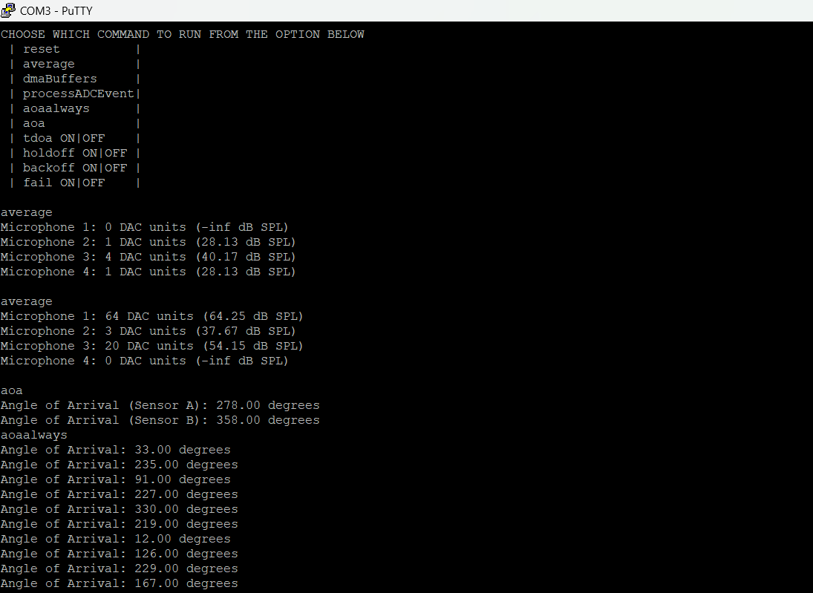

My apologies for that. Here's the corrected README file without the image resize tags:

---

# Angle of Arrival (AoA) Multidirectional Audio System

## Overview
This project aims to develop a cost-effective and energy-efficient device capable of solving the angle of arrival (AoA) problem using a multidirectional array of microphones. The system is designed to work efficiently in resource-constrained environments, utilizing the TM4C123GH6PM microcontroller.

## Table of Contents
- [Overview](#overview)
- [Objectives](#objectives)
- [Hardware Architecture](#hardware-architecture)
- [Software Development](#software-development)
- [Setup Instructions](#setup-instructions)
- [Usage](#usage)
- [Testing](#testing)
- [Project Report](#project-report)
- [Future Improvements](#future-improvements)
- [Contributions](#contributions)
- [License](#license)
- [References](#references)

## Objectives
- Develop an embedded system for accurate AoA calculation.
- Ensure low power consumption and efficient operation.
- Provide a robust user interface for real-time monitoring and configuration.

## Hardware Architecture
### Microphones and Conditioning Circuits
- Four precision microphones with a sensitivity of -44 dBV/Pa.
- Amplification circuits providing 40 dB gain to ensure signal integrity.

## DMA Buffer Management
DMA buffers are utilized for efficient data transfer between peripherals (like ADCs capturing microphone data) and the microcontroller’s memory.
Implemented to prevent data loss and ensure continuous processing of audio signals.

### Microcontroller
- TM4C123GH6PM ARM Cortex-M4F microcontroller for handling digital signal processing tasks.
- Multiple I/O interfaces facilitating real-time audio data acquisition and processing.

### Serial Interface
- UART0 for communication with a host device via a virtual COM port through a USB endpoint.

### Suggested Parts List
- TM4C123G evaluation board (ARM M4F)
- LM2902 (quad op-amp)
- Various resistors and capacitors
- Electret microphones
- FR4 PC board

## Software Development
### Audio Processing Requirements
- Implement cross-correlation algorithms for precise Time Difference of Arrival (TDoA) calculations necessary for accurate AoA determination.

### Cross-correlation for TDoA Calculation
- Calculate the cross-correlation between signals received at different microphones to derive the TDoA.

### User Interface Commands and Control
- Command-line interface over UART for system configuration, calibration, and real-time processing results.

## Setup Instructions
1. **Hardware Setup**:
   - Connect the microphones and conditioning circuits as per the provided schematics.
   - Assemble the microcontroller and connect it to the sensors.

2. **Software Setup**:
   - Clone this repository: `git clone https://github.com/yourusername/aoa-audio-system.git`
   - Navigate to the project directory: `cd aoa-audio-system`
   - Load the firmware onto the TM4C123GH6PM microcontroller using your preferred method.

3. **Running the System**:
   - Open a serial terminal (e.g., PuTTY) and connect to the microcontroller's COM port.
   - Use the command-line interface to configure the system and start monitoring.

## Usage
### Commands
- `reset`: Resets the hardware.
- `average`: Displays average microphone values.
- `level`: Updates the detection threshold.
- `aoa`: Returns the current angle of arrival.
- `tdoa ON|OFF`: Enables or disables the display of TDoA data for qualified events.
- `fail ON|OFF`: Enables or disables the display of partial data from sensors when there is no qualified event.

## Testing
- **Hardware Testing**: Validate hardware functionality using standard equipment.
- **Software Testing**: Verify software accuracy and reliability with various audio inputs.

## Project Report
- Detailed documentation and findings are included in the project report.
- [Embedded Systems II Project Report](reports/Abdulmalik_Ajisegiri_Embedded_ProjectReport.pdf)

## Future Improvements
- **DMA Buffer Management**: Implement advanced buffer management strategies to prevent data loss.
- **Advanced ADCs**: Upgrade ADCs for higher sampling rates and improved accuracy.
- **Adaptive Threshold Algorithms**: Integrate algorithms for real-time threshold adjustment based on ambient noise.

## Contributions
Contributions are welcome! Please open an issue or submit a pull request with your improvements.

## License
This project is licensed under the MIT License. See the [LICENSE](LICENSE) file for details.

## References
- TM4C123GH6PM datasheet
- Online resources

---

This README file provides a comprehensive overview and guidance for potential users and contributors of your project, without any image resize tags. Adjust placeholders (`yourusername`, image paths, etc.) with your actual project details before using it.
